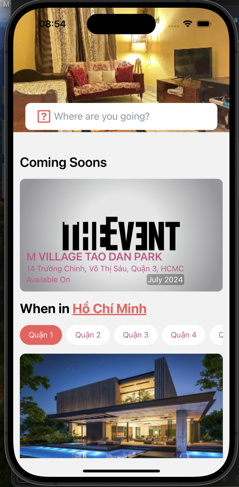
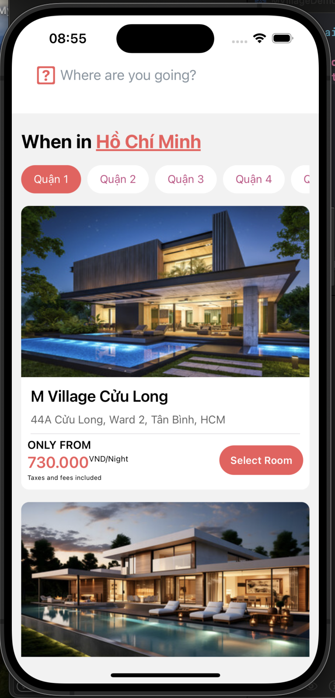

# M Village demo

# Setup

>**Note**: Make sure you have completed the [React Native - Environment Setup](https://reactnative.dev/docs/environment-setup) instructions till "Creating a new application" step, before proceeding.

Install package by command:

```bash
yarn install
```

Then, install pod by command:

```bash
npx pod-install
# Or you can run
cd ios/ && pod install
```

## Step 1: Preparation

Because app is invoking API to get data, so you should do:

1. Create API with path is `{baseUrl}/villages`, response of API is in `src/mock/mockVillages.json` file. [You use postman to create mock server](https://learning.postman.com/docs/designing-and-developing-your-api/mocking-data/mocking-with-examples/)

2. Update `BASE_URL` in `src/api/FetchService.ts` file. We can read `BASE_URL` from environment variable by using [react-native-config](https://www.npmjs.com/package/react-native-config), but it takes time, so now I hard code it.

## Step 2: Start the Metro Server

First, you will need to start **Metro**, the JavaScript _bundler_ that ships _with_ React Native.

To start Metro, run the following command from the _root_ of the project:

```bash
yarn start
```

## Step 3: Start Application

Let Metro Bundler run in its _own_ terminal. Open a _new_ terminal from the _root_ of the project. Run the following command to start _Android_ or _iOS_ app:

### For Android

```bash
yarn android
```

### For iOS

```bash
# using npm
npm run ios

# OR using Yarn
yarn ios
```

# Some screenshots and videos




You can see video in [docs/Record.mov](./docs/Record.mov)
